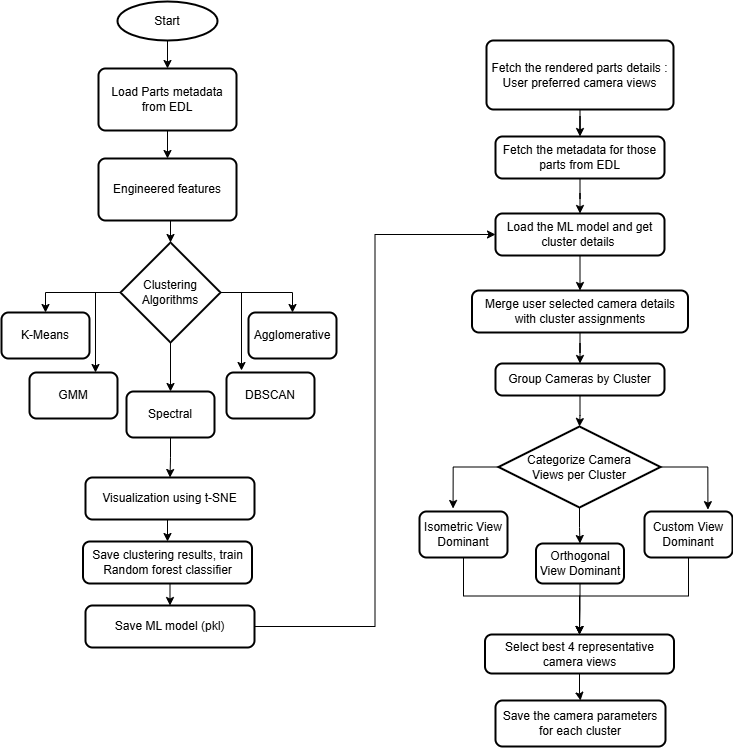

# ML-enabled-parts-rendering-automation
View recommendation system using unsupervised ML clustering. Groups parts by geometrical metadata and assigns preferred rendering views per cluster, streamlining graphics workflows

1. Clustering workflow

- Loading part metadata (from EDL via databricks integration) and feature engineering for significant features extraction
- Multiple clustering algorithms (K-Means, GMM, HDBSCAN, Agglomerative, Spectral) for comparitive analysis- selection of best one
- Refining large clusters through volume based subclustering
- Training of random forest classification
- Visualization of clustering results using t-SNE

2. Camera Parameters Learning from prior user selection

- Fetching of camera parameters from already rendered parts
- collect the camera parameters for each cluster based on the parts metadata
- categorize each cluster for view dominance - Isometric, Orthogonal, and Custom views
- Selects optimal camera distribution per cluster
- Exporting representative cameras for each cluster

3. Prediction of the best 4 camera views for new parts

- Fetch the metadata of the new parts
- Load the clustering model and predict the best 4 camera views 

